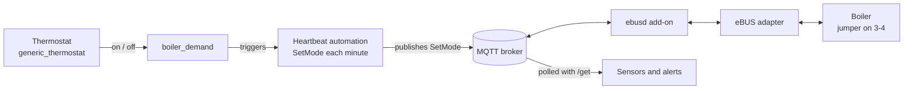

# Vaillant ecoTEC plus: heating control from Home Assistant over eBUS (ebusd)

> **EXPERIMENTAL. Read the safety section before you touch anything.**
> It involves a jumper on the mains-side terminal block of a gas boiler, and the
> boiler fails *towards heating*, not towards off. Not tested over a full heating
> season. Not an official Vaillant method. Use at your own risk.

Start and stop the central heating of a Vaillant ecoTEC plus from Home Assistant
with a generic thermostat, **without a Vaillant controller** and **without
touching hot water**. One package file adds the sensors, a virtual switch, the
thermostat, the automations and the alerts.

## Status

Tested on one boiler: **Vaillant ecoTEC plus VMW ES 296/3-5** (eBUS device
`BAI00`, software 0518, hardware 7401), with the ebusd add-on, an ESP32-C6 eBUS
adapter and MQTT. Other models, especially the newer ..6/5-5 generation, may use
different terminals.

Verified on that boiler (6 Oct 2026):

- A heating demand lights the burner in under 30 seconds (S.2, S.3, S.4 with flame).
- Stopping heating switches the burner off within seconds; the boiler settles at
  S.31 after 1.5 to 4 minutes (S.5, S.7, S.8, S.31), with no hot-water warm-start
  cycles and no S.54 waiting period.
- Hot water starts normally (S.13, S.14) while heating is disabled.
- The MQTT sensors, the polling and the alerts work.

**Not yet verified:** a full run driven by the thermostat itself in cold weather
(the room was warmer than the setpoint during every test), and long-term
behaviour. Reports from other boilers are welcome (see the end).

## Safety: read this first

- **Mains voltage.** Terminals 3-4 ("RT 230 V") sit next to live terminals. On
  these boilers L and N stay live even with the power button off. Unplug the
  boiler or switch off its breaker, and have a qualified installer do it if you
  are not sure. The Vaillant installation manual says the electrical installation
  must be done by the authorised service.
- **Not an official method.** Vaillant does not document controlling the boiler
  this way. Ask your installer or Vaillant about warranty and local regulations.
- **Fail-open.** With the jumper in place the boiler is always allowed to heat.
  Home Assistant only holds it back by sending `disablehc` orders. An order stays
  active for roughly 15 minutes after the last write (measured once, not
  guaranteed). If Home Assistant, MQTT, ebusd or the adapter stop working while
  heating is "stopped", the boiler starts heating by itself, up to the
  temperature set on its own dial, also in summer.

Mitigations:

1. Keep the alerts from this package enabled (no data, flame without demand, pressure).
2. Keep the boiler's flow-temperature dial as the upper limit, and turn it down
   when you leave for several days.
3. Remove the jumper in summer or when the house is empty.
4. A safer design is a potential-free relay on terminals 3-4, driven by Home
   Assistant with an automatic switch-off timer, so a failure leaves the contact
   open. It is not built or tested here.

## How it works



The thermostat switches `input_boolean.boiler_demand` (through a virtual switch).
A heartbeat automation sends one of two `SetMode` orders every minute, and again
whenever the demand changes. Statenumber, Flame and the water pressure are not
published by ebusd until requested, so two small automations poll them.

## Installation

### 1. ebusd and MQTT

Get ebusd talking to the boiler and publishing to MQTT before you change
anything on the boiler. In the ebusd add-on keep the MQTT integration seed on and
add these options, one per entry (use your adapter's address):

```
--device=ens:192.168.0.50:9999
--scanconfig
--mqttjson
--accesslevel=*
```

`--accesslevel=*` is what lets you write `SetMode`. After the scan the boiler
should appear as `Vaillant;BAI00;0518;7401` (your numbers may differ). Three
commands in the add-on terminal cover everything you need:

```
ebusctl find -c bai SetMode          # last value ebusd saw or wrote, not a live read
ebusctl read -m 0 -c bai Statenumber # fresh read from the boiler
ebusctl write -c bai SetMode "auto;45;-;-;1;0;0;0;0;0"
```

`read` on a write-only message answers `ERR: element not found`; use `find` for
those. This package assumes the circuit is called `bai`, so topics look like
`ebusd/bai/SetMode/set`.

### 2. Close the room-thermostat contact (terminals 3-4)

On the tested boiler the burner never lit from eBUS orders alone until terminals
3 and 4 were jumpered.

**Symptom:** `SetMode` was accepted and `FlowTempDesired` followed it, but there
was no flame: `Statenumber` stayed at 30, `Status01` ended in `off` and
`WPPWMPower` was 0. Status S.30 means, per the installation manual, "the room
thermostat blocks heating (terminal 3-4 open)". Confirm from the boiler's side:

```
ebusctl read -m 0 -c bai ACRoomthermostat   # terminals 3-4
ebusctl read -m 0 -c bai DCRoomthermostat   # terminals 7-8-9
ebusctl read -m 0 -c bai Statenumber
```

Here both inputs read `off` (open) and the state was 30.

**Fix:** with the boiler unplugged, put a short insulated wire between terminals
3 and 4 of the "RT 230V" block. Terminal 5 and the 7-8-9 block stay empty. After
the jumper `ACRoomthermostat` reads `on` and the heating starts.

This matches the installation manual of this generation (Vaillant document
0020029099_03, section 5.9.2): with no room thermostat on 3-4 the jumper must be
there, and it stays when an eBUS controller is used. The newer ..6/5-5 boilers
talk about a "24 V=RT" jumper instead; check the manual of your own model.

### 3. Add the package

1. In `configuration.yaml`, enable packages (skip if you already have it):

   ```yaml
   homeassistant:
     packages: !include_dir_named packages
   ```

2. Copy [`packages/vaillant_ebus_heating.yaml`](packages/vaillant_ebus_heating.yaml)
   to `/config/packages/`.
3. Search the file for `CHANGE ME` and adapt:
   - `target_sensor`: your room temperature sensor,
   - the `notify` service in `script.boiler_notify` (your phone),
   - optionally `flow_temp` (radiator flow temperature, default 45 °C).
4. Developer tools, YAML, **Check configuration**, then restart Home Assistant.

If you already have an `mqtt:` section in `configuration.yaml`, Home Assistant
merges the package's `sensor:` list into it. If it complains about duplicates,
move the three sensors into your own `mqtt:` section instead.

### 4. Check it, step by step

1. `sensor.boiler_statenumber` shows a number (31 when idle) and `sensor.boiler_flame`
   shows `off`. Wait a minute after the restart.
2. In the add-on terminal, `ebusctl find -c bai SetMode` shows
   `auto;45.0;-;-;1;0;0;0;0;0`, the stop order (the heartbeat sends it every minute).
3. Put the thermostat in `off`, turn `input_boolean.boiler_demand` on by hand and
   watch the state: `S.0`, `S.2`, `S.3`, `S.4` with flame. Turn it off: `S.5`,
   `S.7`, `S.8`, `S.31`. (With the thermostat in heat mode and a warm room, the
   thermostat switches the demand off again within seconds; that is expected.)
4. Open a hot-water tap while heating is stopped: `S.13`, `S.14` with flame.

## Entities created

| Entity | What it is |
| --- | --- |
| `input_boolean.boiler_demand` | The demand the thermostat switches |
| `switch.boiler_switch` | Virtual switch, the thermostat's heater |
| `climate.boiler_thermostat` | The generic thermostat |
| `sensor.boiler_statenumber`, `sensor.boiler_flame`, `sensor.boiler_water_pressure` | Boiler state read from ebusd |
| `script.boiler_notify` | One place for your notification service |
| `automation.boiler_*` | Heartbeat, two polls, three alerts |

## The two orders

| Action | Order sent to `ebusd/bai/SetMode/set` |
| --- | --- |
| Heat | `auto;45;-;-;0;0;0;0;0;0` |
| Stop heating, hot water untouched | `auto;45;-;-;1;0;0;0;0;0` |

The ten fields, in order, are `hcmode`, `flowtempdesired`, `hwctempdesired`,
`hwcflowtempdesired`, `disablehc`, `disablehwctapping`, `disablehwcload`,
`remotecontrolhcpump`, `releasebackup` and `releasecooling`. Only two change:
`flowtempdesired` is the radiator flow temperature in °C (the boiler's dial caps
it) and `disablehc` is 0 to allow heating and 1 to block it. The two `-` leave
the hot-water targets unset.

## Status codes (`Statenumber`)

Meanings from table 9.1 of the Vaillant installation manual (document
0020029099_03); the last column is what was seen on the tested boiler.

| Code | Meaning | Seen here |
| --- | --- | --- |
| S.0 | No heat demand | A few seconds right after a demand arrived |
| S.2 | Heating: pump pre-run | Before ignition |
| S.3 | Heating: ignition | Before the flame |
| S.4 | Heating: burner running | Within 30 s of the demand |
| S.5, S.6, S.7 | Heating: fan and pump overrun | From the stop order, for about 1 to 3 minutes |
| S.8 | Burner lock after heating | Between S.7 and S.31 |
| S.10, S.13 | Hot water: tap on, ignition | A tap opened |
| S.14 | Hot water: burner running | A tap open |
| S.15, S.16, S.17 | Hot water: overrun | A tap closed |
| S.20 to S.28 | Warm start of the hot-water circuit (S.24 burner on) | After `water;...` orders |
| S.30 | Room thermostat blocks heating (terminals 3-4 open) | Before the jumper |
| S.31 | Summer mode, or no demand from an eBUS controller | Idle, and after `off;...` orders |
| S.53, S.54 | Waiting period for water circulation | After `water;...` orders |
| S.97 | Pressure-sensor test; heating demands blocked while it runs | A few seconds before some starts |

## Pitfalls we hit

- **S.54 blocks everything.** After a `water;...` order the boiler sat in S.54
  for 10 to 20 minutes and neither heating nor hot water started. Do not use
  `water` or `off` to stop heating. `water;...` also set off a short hot-water
  burner cycle (S.24) with no real demand; `off;...` also cut hot water.
- **A hot-water target in `SetMode` may trigger those cycles.** Putting a number
  such as 55 in `hwctempdesired` may be what starts them. We stopped sending it
  and the cycles stopped, but did not isolate it as the cause.
- **The thermostat vetoes manual demand.** In heat mode, with the room above the
  setpoint plus the hot tolerance, the thermostat switched `boiler_demand` off
  15 to 40 seconds after it was turned on by hand. For manual tests put the
  thermostat in `off`.
- **Something may flip the thermostat back to heat.** In our logbook mode changes
  came from a presence automation, a web app and us. Check the thermostat's
  logbook entry before blaming the boiler.
- **S.97 comes first on some starts.** Heating demands are ignored for roughly 10
  seconds while the pressure sensor is tested.
- **`find` is not a live reading.** Use `ebusctl read -m 0` for the boiler's real state.
- **The pressure entity is not the pressure.** The ebusd discovery creates an
  entity called `WaterpressureMeasureCounter`; it counts measurements. The real
  value is the `WaterPressure` message (`press.value`).
- **Sensors without polling stay empty.** `Statenumber` and `Flame` read
  `no data stored` until something requests them.

## Open points

- A heating run driven by the thermostat in real cold weather.
- Short cycling: the thermostat tolerance is 0.3 °C on both sides; the boiler's
  burner lock (S.8, default up to 20 minutes, diagnostic code d.2) should limit
  it, but it was not watched over a day.
- The 15-minute order lifetime was measured once.
- On the first afternoon the thermostat went back to heat on its own three times,
  17 to 52 seconds after being switched off, with no automation named in the
  logbook. It did not repeat in the evening and was not explained.
- Only the 296/3-5 (BAI00 0518/7401) is known to work. Reports from other
  ecoTEC plus / pro boilers, especially ones with a 24 V=RT terminal, would help.
- Warranty and regulations: not checked.

## Rollback

1. Delete `packages/vaillant_ebus_heating.yaml` and restart Home Assistant.
2. Remove the jumper from terminals 3-4 (boiler unplugged).
3. Orders already written expire on the boiler after about 15 minutes.

## Feedback

Open an issue with your boiler model, the `scan` result (`Vaillant;BAI00;...`),
what you changed and what you saw in `Statenumber`. Pull requests that add
verified information for other models are welcome.

## License

MIT, see [LICENSE](LICENSE). No warranty of any kind.
